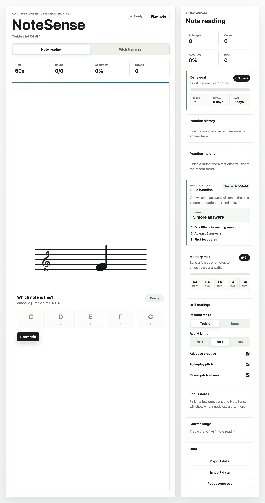
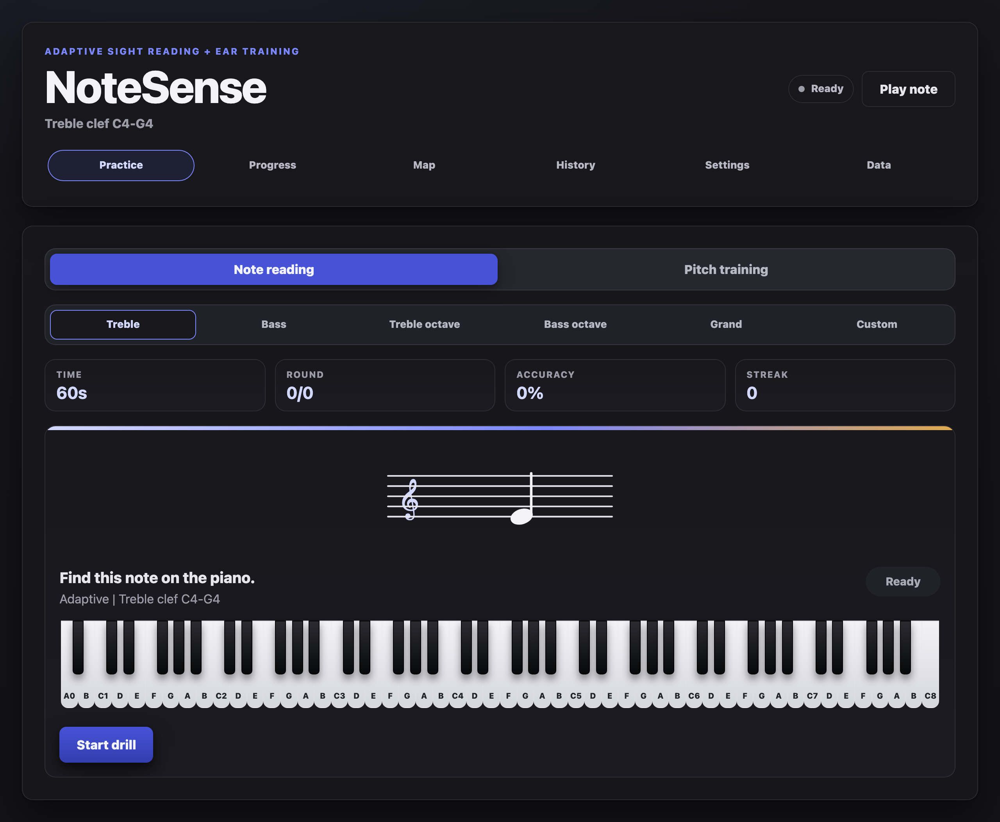

# NoteSense

[](https://github.com/llnysllf/notesense/actions/workflows/ci.yml)
[](https://github.com/llnysllf/notesense/actions/workflows/visual-regression.yml)
[](https://github.com/llnysllf/notesense/actions/workflows/deploy-pages.yml)
[](https://github.com/llnysllf/notesense/actions/workflows/codeql.yml)
[](https://github.com/llnysllf/notesense/actions/workflows/dependency-review.yml)

NoteSense is a local-first piano sight-reading and ear-training app for beginner musicians. It helps learners practice starter staff notes, recognize natural pitches, and build repeatable practice habits without accounts, tracking, or a backend.

Live app: [llnysllf.github.io/notesense](https://llnysllf.github.io/notesense/)

| Light                                                                         | Dark                                                                        |
| ----------------------------------------------------------------------------- | --------------------------------------------------------------------------- |
|  |  |

## Product Promise

NoteSense is intentionally small, but it is treated like a production product. The project optimizes for a fast practice loop, durable architecture, privacy, accessibility, release discipline, and clear future expansion paths instead of feature count.

The current product does three things well:

- Gives beginners short note-reading drills for starter treble and bass ranges.
- Trains recognition of natural piano pitches from C4 to B4.
- Keeps progress local, portable, and resilient when browser storage behaves badly.

The product deliberately does not include accounts, sync, a backend, analytics, payments, classroom tools, sharps/flats, MIDI, translated UI, or runtime locale switching yet. Those can come later, but only after the foundation and product evidence justify them.

## Current Capabilities

- Timed note-reading and pitch-training rounds.
- Adaptive or random item selection that can focus weaker notes.
- Keyboard and on-screen answers.
- Web Audio playback for pitch association.
- Instant feedback, optional pitch reveal, and round summaries.
- Daily goal, streak, recent history, practice insight chart, practice-plan coach, and mastery map.
- Local JSON import/export with schema validation and migration support.
- Safe LocalStorage failure handling with learner-facing recovery.
- Automatic light/dark theme, installable PWA, and offline practice after first load.

## Technology

| Area             | Choices                                                        |
| ---------------- | -------------------------------------------------------------- |
| App              | React, TypeScript, Vite                                        |
| Product logic    | Framework-independent TypeScript modules                       |
| Testing          | Vitest, Playwright, Testing Library, axe-core                  |
| Quality          | ESLint, Prettier, strict TypeScript, custom contract checks    |
| Platform         | GitHub Pages, Vite PWA service worker, Web Audio, LocalStorage |
| Data portability | Versioned local JSON import/export                             |

## Run Locally

Use the Node.js and npm versions pinned by `.nvmrc`, `package.json`, and `.npmrc`.

```bash
nvm use
npm ci
npm run dev
```

Useful commands:

| Command                      | Purpose                                                 |
| ---------------------------- | ------------------------------------------------------- |
| `npm run dev`                | Start the Vite dev server                               |
| `npm run build`              | Build the production app                                |
| `npm run build:pages`        | Build with the GitHub Pages `/notesense/` base path     |
| `npm test`                   | Run unit and component tests                            |
| `npm run test:e2e`           | Run browser workflow tests                              |
| `npm run check`              | Run the local foundation gate                           |
| `npm run verify`             | Run the full release-readiness gate                     |
| `npm run deploy:verify-live` | Verify the public GitHub Pages deployment after release |

## Quality Model

NoteSense uses ordinary engineering checks plus small contract scripts that protect the project's most important promises. The intent is to make drift visible before the app grows.

| Promise              | How it is protected                                                                 |
| -------------------- | ----------------------------------------------------------------------------------- |
| Product focus        | [docs/PRODUCT_SCOPE.md](docs/PRODUCT_SCOPE.md) and `npm run product:check`          |
| Product learning     | [docs/PRODUCT_LEARNING.md](docs/PRODUCT_LEARNING.md) and `npm run product:learning` |
| Architecture         | [docs/ARCHITECTURE.md](docs/ARCHITECTURE.md) and `npm run architecture:check`       |
| Data portability     | [docs/DATA_CONTRACT.md](docs/DATA_CONTRACT.md) and `npm run data:check`             |
| Security and privacy | [docs/SECURITY_PRIVACY.md](docs/SECURITY_PRIVACY.md) and `npm run security:privacy` |
| Accessibility        | [docs/ACCESSIBILITY.md](docs/ACCESSIBILITY.md) and `npm run accessibility:check`    |
| Design system        | [docs/DESIGN_SYSTEM.md](docs/DESIGN_SYSTEM.md) and `npm run design:check`           |
| Testing strategy     | [docs/TESTING.md](docs/TESTING.md) and `npm run testing:check`                      |
| Browser support      | [docs/BROWSER_SUPPORT.md](docs/BROWSER_SUPPORT.md) and `npm run browsers:check`     |
| Performance          | [docs/PERFORMANCE.md](docs/PERFORMANCE.md) and `npm run performance:check`          |
| Operations           | [docs/OPERATIONS.md](docs/OPERATIONS.md) and `npm run operations:check`             |
| Observability        | [docs/OBSERVABILITY.md](docs/OBSERVABILITY.md) and `npm run observability:check`    |
| Release safety       | [docs/RELEASE_SAFETY.md](docs/RELEASE_SAFETY.md) and `npm run release:safety`       |
| I18n/l10n readiness  | [docs/I18N.md](docs/I18N.md) and `npm run i18n:check`                               |
| Legal/licensing      | [docs/LEGAL.md](docs/LEGAL.md) and `npm run legal:check`                            |

For release-ready work, `npm run verify` is the bar. It includes supply-chain checks, the foundation gate, browser resilience tests, Pages build verification, CSP and metadata checks, PWA checks, runtime-surface checks, bundle budgets, and the Pages smoke suite.

## Architecture Map

```text
src/
  App.tsx            App shell, state coordination, and round flow
  practiceEngine.ts  Pure practice logic, scoring, summaries, mastery, and coaching
  noteData.ts        Treble, bass, and pitch-note definitions
  storage.ts         LocalStorage load, normalize, migrate, save, import, and export
  audio.ts           Web Audio playback
  components/        Focused UI sections and app-level error boundary
  hooks/             Session, progress, settings, and data-portability orchestration
shared/
  src/               Framework-agnostic data contracts, normalization, and merge logic
e2e/                 Browser, resilience, Pages, and visual-regression suites
docs/                Product, architecture, operations, release, and governance contracts
scripts/             Local contract checks and release verification utilities
```

Core boundaries to preserve:

- Keep practice selection, summaries, coaching, and mastery logic outside React.
- Keep persistence behind `src/storage.ts` and shared data contracts.
- Keep browser components focused on presentation and accessible state.
- Keep future backend, sync, analytics, telemetry, and database work behind reviewed contracts before implementation.
- Keep static deployment assumptions tested against the `/notesense/` GitHub Pages base path.

## Operating Model

The current production surface is a static GitHub Pages app. There is no hosted account system, backend API, database, analytics service, telemetry sink, support queue, SLA, staging environment, canary rollout, generated SBOM, signed artifact, or automated rollback yet.

That is acceptable for the current local-first product, but the boundaries are explicit:

- Releases go through reviewed pull requests, GitHub Actions, `npm run verify`, and post-deploy live verification.
- Incidents use [docs/OPERATIONS.md](docs/OPERATIONS.md) and [docs/POSTMORTEM_TEMPLATE.md](docs/POSTMORTEM_TEMPLATE.md).
- Future telemetry, monitoring, analytics, support workflows, product experiments, staging, canary, SBOM, provenance, signing, accounts, sync, or backend APIs must update the relevant contracts before code lands.
- The browser app must not connect directly to PostgreSQL or any other database.

## Documentation Index

| Need                         | Start here                                                                           |
| ---------------------------- | ------------------------------------------------------------------------------------ |
| Product scope and non-goals  | [docs/PRODUCT_SCOPE.md](docs/PRODUCT_SCOPE.md)                                       |
| Product feedback model       | [docs/PRODUCT_LEARNING.md](docs/PRODUCT_LEARNING.md)                                 |
| Architecture boundaries      | [docs/ARCHITECTURE.md](docs/ARCHITECTURE.md)                                         |
| Quality and local validation | [docs/QUALITY.md](docs/QUALITY.md)                                                   |
| Testing ownership            | [docs/TESTING.md](docs/TESTING.md)                                                   |
| Design system                | [docs/DESIGN_SYSTEM.md](docs/DESIGN_SYSTEM.md)                                       |
| Accessibility                | [docs/ACCESSIBILITY.md](docs/ACCESSIBILITY.md)                                       |
| Browser support              | [docs/BROWSER_SUPPORT.md](docs/BROWSER_SUPPORT.md)                                   |
| Performance                  | [docs/PERFORMANCE.md](docs/PERFORMANCE.md)                                           |
| Data contract                | [docs/DATA_CONTRACT.md](docs/DATA_CONTRACT.md)                                       |
| Internationalization         | [docs/I18N.md](docs/I18N.md)                                                         |
| Privacy                      | [docs/PRIVACY.md](docs/PRIVACY.md)                                                   |
| Security and privacy         | [docs/SECURITY_PRIVACY.md](docs/SECURITY_PRIVACY.md)                                 |
| Threat model                 | [docs/THREAT_MODEL.md](docs/THREAT_MODEL.md)                                         |
| Backend readiness            | [docs/BACKEND_READINESS.md](docs/BACKEND_READINESS.md)                               |
| Operations                   | [docs/OPERATIONS.md](docs/OPERATIONS.md)                                             |
| Observability                | [docs/OBSERVABILITY.md](docs/OBSERVABILITY.md)                                       |
| Release process              | [docs/RELEASE.md](docs/RELEASE.md), [docs/RELEASE_SAFETY.md](docs/RELEASE_SAFETY.md) |
| Dependency maintenance       | [docs/DEPENDENCY_MAINTENANCE.md](docs/DEPENDENCY_MAINTENANCE.md)                     |
| Review process               | [docs/REVIEW_PROCESS.md](docs/REVIEW_PROCESS.md)                                     |
| Architecture decisions       | [docs/adr/README.md](docs/adr/README.md)                                             |
| Legal                        | [docs/LEGAL.md](docs/LEGAL.md)                                                       |
| Contributing                 | [CONTRIBUTING.md](CONTRIBUTING.md)                                                   |
| Code of Conduct              | [CODE_OF_CONDUCT.md](CODE_OF_CONDUCT.md)                                             |
| Security policy              | [SECURITY.md](SECURITY.md)                                                           |
| Changelog                    | [CHANGELOG.md](CHANGELOG.md)                                                         |

## Contributing

Read [CONTRIBUTING.md](CONTRIBUTING.md) before opening a change. The short version:

- Prefer small, shippable changes with clear learner value or clear maintainability value.
- Update the contract doc that owns the behavior you are changing.
- Add or update tests where the change affects product behavior, storage, accessibility, release behavior, or shared contracts.
- Run the narrowest useful checks while developing and `npm run verify` before release-ready work.
- Do not expand product scope just to make the app look bigger.

Participation is covered by [CODE_OF_CONDUCT.md](CODE_OF_CONDUCT.md).

## License

All rights reserved. See [LICENSE](LICENSE) and the legal/licensing contract in [docs/LEGAL.md](docs/LEGAL.md).

## Why This Exists

I am learning piano and wanted a simple tool to improve note-reading speed and pitch recognition. NoteSense stays small on purpose: a focused learner surface, a strong foundation, and a clean path for future features when they are truly worth adding.
